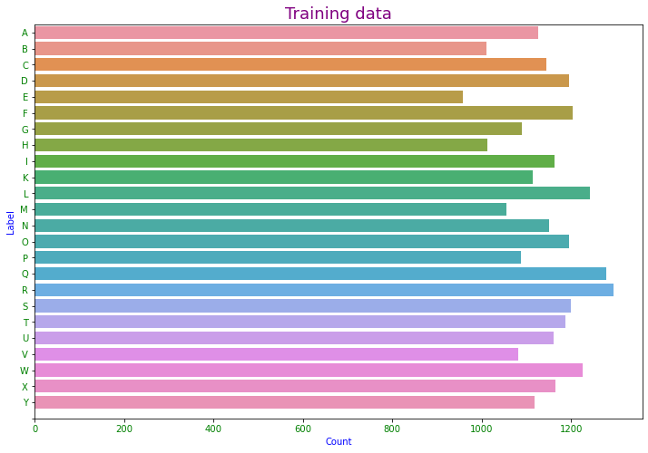
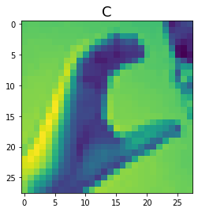
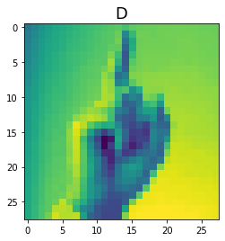
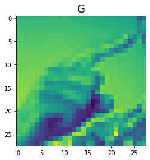

# ASL Alphabet Image Recognition

 ## Contents:
 
- [Problem Statement](#Problem-Statement)  
- [Data](#Data)
- [Data Analysis](#Data-Analysis)
- [Interesting Observations](#Interesting-Observations)

&nbsp;

## Problem Statement:
This project aims to recognize the American Sign Language alphabet from an image.Ability to read hand gestures expands access to the differently abled. In addition, gesture recognition finds applications in a wide range of verticals from medicine to home automation.

&nbsp;

## Data
The initial set of training and validation images were obtained from [Kaggle](chttps://www.kaggle.com/datamunge/sign-language-mnist)
There was no significant class imbalance. J and Z alphabets involve movement and are  hence not present in this data set

Sample of  training data - 28x28 pixels gray scale

   

## Data Analysis:
[Notebook for EDA and models](code/EDA_Models.ipynb)

**Data Cleaning**
- Only the post itself was used as our feature
- Null, [removed] and [deleted] values were dropped.
- We had nearly 24K documents  after dropping the invalid text posts.

**Modeling**

Multinomial Naive Bayes with Count vectorizor gave the best accuracy score of **94.4%** on the testing data with low variablity. The other model  tried to fit, TFID with Random forest  was overfit. Hence the model was not used. Below is the confusion matrix for the NB with CV.

    
## Interesting Observations:

- 'just', 'really', 'like','time' were the most common words across both boards
- 'know' was one of the top 10 words in Books
- 'think' was one of the top 10 words in Movies

## Next Steps:

- Try a pipeline with Count Vectorizor and then NB 
- Remove words strongly related to movies like 'movie; 'watch' from the book corpus and vice versa.

