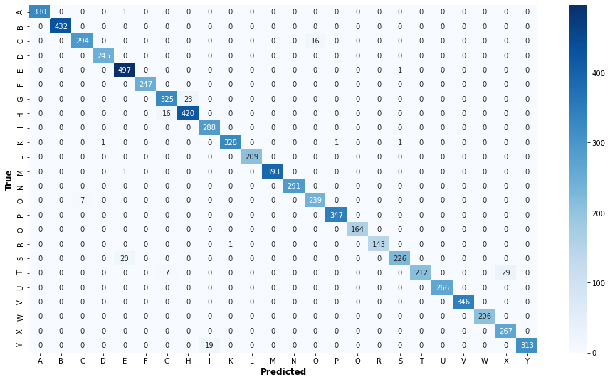

# ASL Alphabet Image Recognition

 ## Contents:
 
- [Problem Statement](#Problem-Statement)  
- [Data](#Data)
- [Model](#Convolusional-Neural-Network-Model)
- [Challenges](#Challenges)
- [Next Steps](#Next-Steps)

&nbsp;

## Problem Statement:
This project aims to recognize the American Sign Language alphabet from an image.Ability to read hand gestures expands access to the differently abled. In addition, gesture recognition finds applications in a wide range of verticals from medicine to home automation.

&nbsp;

## Data
The initial set of training and validation images were obtained from [Kaggle](https://www.kaggle.com/datamunge/sign-language-mnist)
There was no significant class imbalance. J and Z alphabets involve movement and are  hence not present in this data set

&nbsp;

## Convolusional Neural Network Model:
The CNN model was built using Keras.
Image augmentation techniques are used to maximise the use of our few training examples to generalize better.
Batch Normalization and Dropout layers are used to avoid overfitting.
[Notebook for Data prep and model](DataPrep_CNN.ipynb)

Our final model has a 97.29% accuracy with test data.

&nbsp;
   

[Streamlit script](AlphabetASL.py) loads a page that accepts an image , uses the model above to  identify the alphabet

&nbsp;
   

## Challenges:

Although we are seeing a great testing accuracy. The model is not performing as well on images taken in other conditions.

&nbsp;
 
 
## Next Steps:

- Data Augemntation :  The current data augemntation has zoom , rotation , height and width shift. Change brightness levels as well in the train data
- Use more images taken in different conditions.

